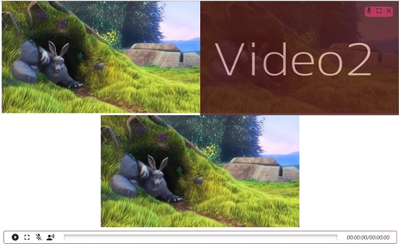
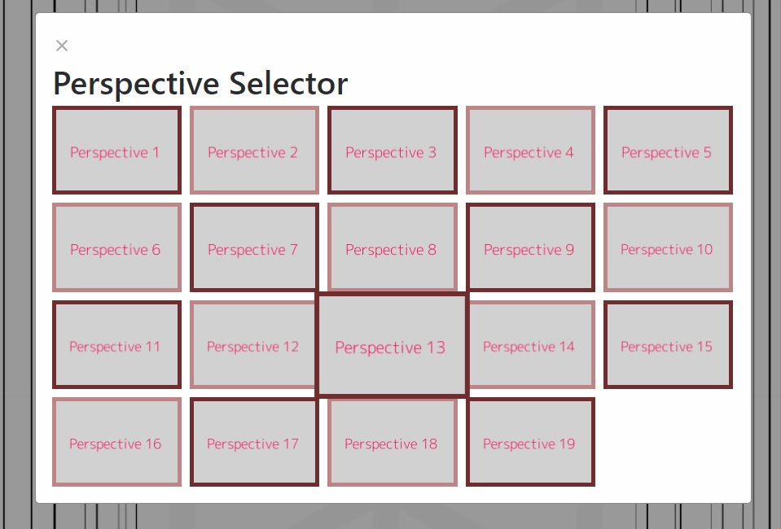

# MULTI VIDEO DASH INTEGRATION

This project covers the implementation of an MPEG-DASH player to control several videos and one main audio at the same time.

It aims to generate an open source video tool to help researchers, trainers or educators analyze scenes with different perspectives at the same time.

For example, A tennis trainer that wants to analyze the movements of his students could set 4 cameras at different points and save different snippets to show to the students how they can improve his movements.

Pressing the key "S" opens the Perspective selector that handles the addition of new perspectives to the video player.

## How to use

For using this project on your local machine you should have npm manager installed, install the dependencies and run "npm run start," this will start the gulp tasks to build the app and watch for changes in the development process.

For the video player, I'm using "dash.js" as it has adaptive streaming capabilities for an excellent cross-browser experience.

One of the first problems that I had when I started to study "dash.js" is the video file format that it needs to work correctly. You can give to the player a plain mp4 but if you want to unleash the capabilities of dash.js you need a manifest (.mpd), render the different qualities (1080p, 720p, 540p, 360p, etc..) and create an audio file.

If you want to generate your videos from your raw recordings, you should take a look at FFmpeg and shaka packager projects.

Additionally, I made a python script to render and package everything in the same step. If you want to use it(or help me improve it) here, you have the [link](https://github.com/Olcina/Py2DASH)  to the repository.

If you don't want to spend time rendering your videos don't worry, I also added to the repository an open video test ready to be played with the MultiVideoPlayer.

##  About the project

Right now the project is in an early stage of development. So, If you want to help me below, you can find the following implementations that I want to add to the project. I'm entirely open to new ideas or comments about this project. Feel free to contact me at my e-mail.

## CONTRIBUTING

I've made a file with the task that I'm going to develop next if you want to help look at them here [CONTRIBUTING.md](./CONTRIBUTING.md)